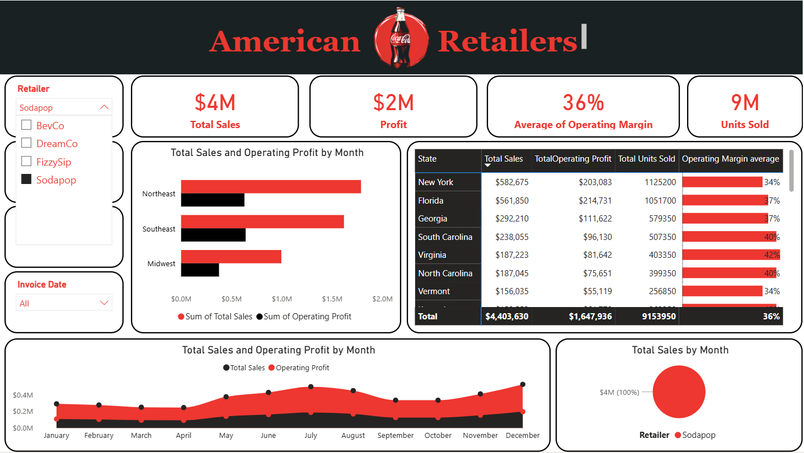
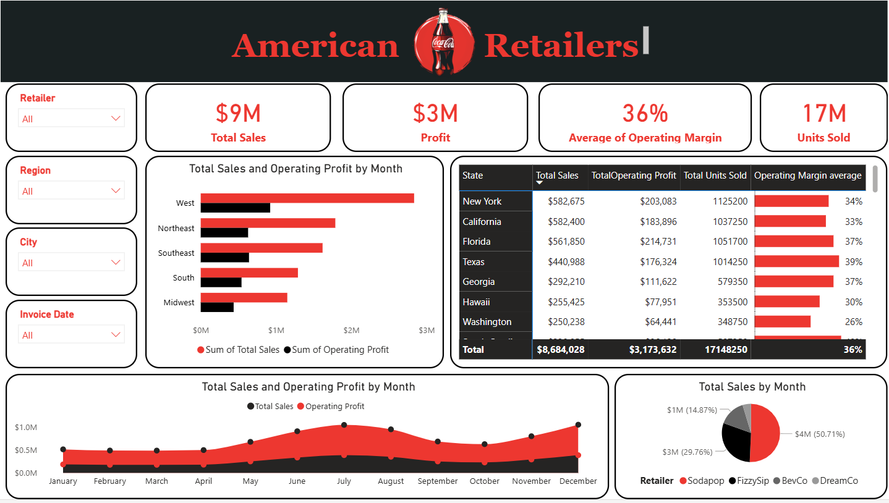

# 🥤 Coca-Cola US Retail Performance — Power BI Dashboard

> An interactive Power BI dashboard analyzing Coca-Cola sales performance across American retailers and states — covering $9M in total sales, 17M units sold, and a 36% operating margin across 4 retailers and multiple US regions.

---

## 📌 Project Overview

This project transforms Coca-Cola retail transaction data into a fully interactive Power BI dashboard, enabling stakeholders to analyze sales performance, operating profit, and market penetration across US states, regions, cities, retailers, and time periods.

| Detail | Info |
|---|---|
| **Tool** | Microsoft Power BI |
| **Total Sales** | $8,684,028 (~$9M) |
| **Total Profit** | $3,173,632 (~$3M) |
| **Operating Margin** | 36% average |
| **Units Sold** | 17,148,250 (~17M) |
| **Retailers** | Sodapop · FizzySip · BevCo · DreamCo |
| **Filters** | Retailer · Region · City · Invoice Date |

---

## 📊 Dashboard Screenshots

### Full Overview — All Retailers & Regions

Complete US market picture: **$9M sales**, **$3M profit**, **36% margin**, **17M units**. West leads by region. New York and California top the state rankings. Sodapop dominates with 50.71% of total sales.

---

### Filtered — Sodapop Retailer Only

Sodapop deep-dive: **$4M sales**, **$2M profit**, **9M units**. Northeast and Southeast are Sodapop's strongest regions. New York and Florida lead at the state level with consistent 34–37% margins.

---

### Filtered — Charleston City

City-level drill-down for Charleston: **$309K sales**, **$121K profit**, **37% margin**, **662K units**. Southeast dominates. South Carolina leads at $238K with a 40% margin.

---

## 💡 Key Insights

- 💰 **Total Sales: $8.68M** | **Profit: $3.17M** | **36% operating margin**
- 🏆 **Sodapop** is the #1 retailer at **$4M (50.71%)** of total sales
- 🗺️ **West region** leads all regions in total sales and profit
- 🏙️ **New York** is the top state at **$582K** — closely followed by California and Florida
- 📈 **Sales peak in summer (June–August)** — clear seasonal pattern across all retailers
- 💹 **Texas** has the highest operating margin at **39%** despite lower absolute sales
- 🔴 **FizzySip** and **BevCo** together account for ~50% of remaining market share

---

## 🛠️ Tools & Techniques

- **Microsoft Power BI** — Interactive single-page dashboard
- **DAX** — Calculated measures for sales totals, profit margins, and KPI cards
- **Data Modeling** — Retailer, region, city, state, and date relationships
- **Visualizations** — Clustered bar chart, Area chart, Pie chart, Matrix table, KPI cards
- **Filters** — Retailer dropdown, Region dropdown, City dropdown, Invoice Date

---

## 📁 Files in This Repo

| File | Description |
|---|---|
| `Key_American_Coca-Cola_Retailers.pbix` | Full Power BI report file |
| `1.png` | Full overview — all retailers & regions |
| `2.png` | Coca-Cola brand visual |
| `3.png` | Filtered — Sodapop retailer only |
| `7beaa53423caa77c28b3f7a885daf82f.png` | Filtered — Charleston city drill-down |

---

## 🚀 How to Use

1. Download `Key_American_Coca-Cola_Retailers.pbix`
2. Open in **Microsoft Power BI Desktop** (free download from Microsoft)
3. Use **Retailer**, **Region**, **City**, and **Invoice Date** dropdowns to filter
4. Click any bar or chart element to cross-filter all visuals
5. Hover over the state table for detailed margin breakdowns

---

## 👤 Author

**Belal Farrag** — Data Analyst

